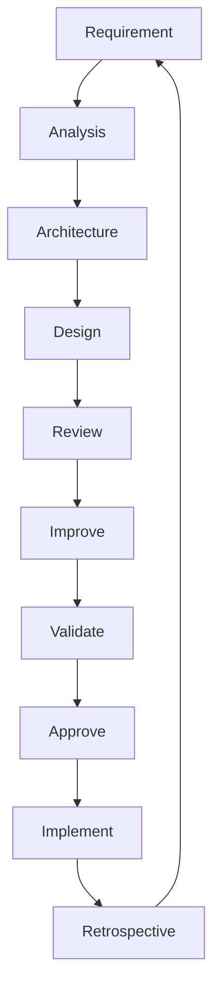

# DOC 0.11 — AI Loop Framework

**Document ID:** 0.11  
**Title:** AI Loop Framework — Iterative Development & Review Process  
**Version:** 1.0.0  
**Status:** Approved  
**Owner:** AI Development Loop Process  
**Date:** 2026-07-13  
**Purpose:** Define the mandatory iterative loop used for every EduOMR feature so that requirements, design, implementation, review, validation, and approval happen in a controlled, traceable sequence.

---

## 1. Mission

The AI Loop Framework ensures every feature is developed with discipline, traceability, and quality. It prevents phase skipping, design drift, and unreviewed implementation.

**Core Principle:**
> No feature moves forward unless the current step is complete, reviewed, and approved.

This applies to:
- Documentation
- Architecture
- Design
- Code generation
- Testing
- Security review
- Performance review
- UI/UX review
- Refactoring

---

## 2. Standard Development Loop

### 2.1 Required Sequence

Every feature must follow this exact order:

1. **Requirement**
2. **Analysis**
3. **Architecture**
4. **Design**
5. **Review**
6. **Improve**
7. **Validate**
8. **Approve**
9. **Implement**
10. **Retrospective**

### 2.2 Loop Diagram

### 2.3 Stage Definitions

#### 1. Requirement
Define what must be built, without implementation details.

**Outputs:**
- User story or feature description
- Scope boundaries
- Acceptance criteria
- Constraints

**Checklist:**
- [ ] Problem clearly stated
- [ ] Scope defined
- [ ] Constraints identified
- [ ] Success criteria measurable

#### 2. Analysis
Understand the requirement in detail and identify risks.

**Outputs:**
- Domain analysis
- Dependencies
- Edge cases
- Risks and assumptions

**Checklist:**
- [ ] Edge cases documented
- [ ] Dependencies listed
- [ ] Risks identified
- [ ] Assumptions explicit

#### 3. Architecture
Choose the structure and major technical approach.

**Outputs:**
- Module boundaries
- Data flow
- API structure
- Storage approach
- Integration points

**Checklist:**
- [ ] Architecture aligns with project principles
- [ ] No shortcut introduced
- [ ] Multi-tenancy considered
- [ ] Security considered
- [ ] Scalability considered

#### 4. Design
Create detailed design for implementation.

**Outputs:**
- UI/UX design if applicable
- API contract
- Data models
- Validation rules
- Error handling

**Checklist:**
- [ ] Design matches requirement
- [ ] Design matches architecture
- [ ] No missing flows
- [ ] Error states defined

#### 5. Review
Independent review by the appropriate reviewer prompt.

**Outputs:**
- Findings
- Severity ranking
- Decision: pass / conditional / fail

**Checklist:**
- [ ] Security reviewed if needed
- [ ] Performance reviewed if needed
- [ ] UI/UX reviewed if needed
- [ ] Architecture reviewed if needed
- [ ] Testing strategy reviewed

#### 6. Improve
Address review findings.

**Outputs:**
- Updated document or code
- Remediation notes

**Checklist:**
- [ ] All critical findings resolved
- [ ] Medium findings addressed or accepted
- [ ] Changes remain within scope

#### 7. Validate
Verify the change with tests, checks, or inspection.

**Outputs:**
- Test results
- Build results
- Lint results
- Manual verification notes

**Checklist:**
- [ ] Validation executed
- [ ] Validation passed
- [ ] No regressions introduced

#### 8. Approve
Formal approval before implementation or release.

**Outputs:**
- Approval record
- Sign-off status

**Checklist:**
- [ ] Reviewer signed off
- [ ] Owner signed off
- [ ] No unresolved blockers

#### 9. Implement
Only after approval, implement the feature.

**Outputs:**
- Code changes
- Updated docs
- Migrations if required

**Checklist:**
- [ ] Implementation matches approved design
- [ ] No unapproved scope creep
- [ ] Tests updated

#### 10. Retrospective
Capture lessons learned.

**Outputs:**
- What worked
- What failed
- What to improve next time

**Checklist:**
- [ ] Notes captured
- [ ] Improvements recorded
- [ ] New patterns shared

---

## 3. Loop Rules

### 3.1 Hard Rules

- No phase skipping
- No implementation before approval
- No review after implementation starts for unresolved design questions
- No undocumented changes
- No merging without validation
- No ad hoc exceptions without owner approval

### 3.2 Soft Rules

- Keep each loop iteration small
- Prefer one concern per loop
- Prefer reversible changes
- Prefer explicit assumptions over hidden assumptions

### 3.3 Loop Boundaries

A loop ends only when:
- Requirement is approved
- Design is approved
- Implementation is completed
- Validation passes
- Retrospective is recorded

If validation fails, the loop returns to Improve.
If requirements change, the loop returns to Requirement.

---

## 4. Review Gate Matrix

| Artifact | Required Reviewers | Required Validation |
|---|---|---|
| Requirement doc | Founder, Architect | Requirement checklist |
| Architecture doc | Architect, Security Reviewer, Performance Reviewer | Architecture checklist |
| UI/UX design | UI/UX Reviewer | Visual and interaction validation |
| Code changes | Reviewer, Security Reviewer, Performance Reviewer | Tests, lint, build |
| Database changes | Architect, Security Reviewer | Migration test, query validation |
| External integration | Security Reviewer, Performance Reviewer | Mock/API validation |

---

## 5. Feedback Loop Rules

### 5.1 Review Feedback Format

Every review finding must include:
- Title
- Severity
- Evidence
- Recommendation
- Owner
- Target resolution date

### 5.2 Feedback Prioritization

- **Critical:** Blocks progress immediately
- **High:** Must be fixed before approval
- **Medium:** Requires documented remediation plan
- **Low:** Can be scheduled if accepted by owner

### 5.3 Feedback Handling

- Do not ignore feedback
- Do not partially resolve critical issues
- Do not mix unrelated fixes into one loop
- Revalidate after every material change

---

## 6. Implementation Loop Rules

### 6.1 Small Batch Rule

Implement in small batches so failures are easier to isolate.

**Preferred batch size:**
- One feature
- One module
- One endpoint
- One document revision

### 6.2 Change Isolation

Each change should be traceable to a single requirement or review finding.

**Checklist:**
- [ ] Change has a clear reason
- [ ] Change has a clear owner
- [ ] Change has a clear validation method
- [ ] Change does not introduce unrelated behavior

### 6.3 If Something Breaks

When validation fails:
1. Stop
2. Identify root cause
3. Revert if needed
4. Fix the smallest possible slice
5. Validate again

---

## 7. Loop Artifacts

Each loop iteration should produce some or all of the following:
- Requirement note
- Analysis note
- Architecture note
- Design note
- Review report
- Improvement note
- Validation result
- Approval record
- Implementation diff
- Retrospective note

These artifacts should be stored in the approved project documentation structure.

---

## 8. Example Loop Scenario

### Feature: Student Result Review

1. **Requirement:** Student can see score, rank, and per-question breakdown.
2. **Analysis:** Must not expose answer key before release; result data is tenant-scoped.
3. **Architecture:** Results module with repository, service, controller, and audit logging.
4. **Design:** API returns score, percentage, rank, breakdown only after release.
5. **Review:** Security reviewer checks answer key exposure; architecture reviewer checks boundaries.
6. **Improve:** Remove any accidental answer key fields from response DTO.
7. **Validate:** API tests confirm only allowed fields are returned.
8. **Approve:** Founder and architect approve.
9. **Implement:** Merge code and database changes.
10. **Retrospective:** Record the lesson that result DTOs must be separate from scoring entities.

---

## 9. Loop Anti-Patterns

### 9.1 Skipping Review

❌ Wrong:
- Implement first, ask for review later

✅ Correct:
- Review design before implementation

### 9.2 Mixing Too Much

❌ Wrong:
- Requirement, architecture, implementation, and testing all changed in one uncontrolled pass

✅ Correct:
- Keep each loop step narrow and traceable

### 9.3 Hidden Assumptions

❌ Wrong:
- Assume tenant isolation is "obvious"

✅ Correct:
- Explicitly state tenant isolation in design and validation

### 9.4 Unvalidated Approval

❌ Wrong:
- Approve because the code looks fine

✅ Correct:
- Approve only after tests and checks pass

---

## 10. Loop Enforcement

The loop framework must be enforced by process, not trust.

**Required enforcement mechanisms:**
- Documentation templates
- Review checklists
- Validation steps
- Approval sign-off
- Git history traceability

**No loop step may be considered complete without evidence.**

---

## 11. Loop Framework Sign-Off

This document defines the mandatory development loop for EduOMR.

**No feature is accepted unless:**
1. ✅ Every required stage is completed in order
2. ✅ Review findings are addressed
3. ✅ Validation passes
4. ✅ Approval is recorded
5. ✅ Retrospective is captured

---

## Revision History

| Version | Date | Status | Notes |
|---|---|---|---|
| 1.0.0 | 2026-07-13 | Draft | Initial creation |
| 1.0.0 | 2026-07-14 | Approved | Approved after review — loop structure validated |

---

## Approval Sign-Off

**Document:** DOC 0.11 — AI Loop Framework  
**Status:** ✅ Approved

| Role | Name | Date | Status |
|---|---|---|---|
| Founder | Abhishek Atole | 2026-07-14 | ✅ Approved |
| Process Owner | opencode | 2026-07-14 | ✅ Approved |

---

**Next:** After approval, proceed to DOC 0.12 — Coding Standards
